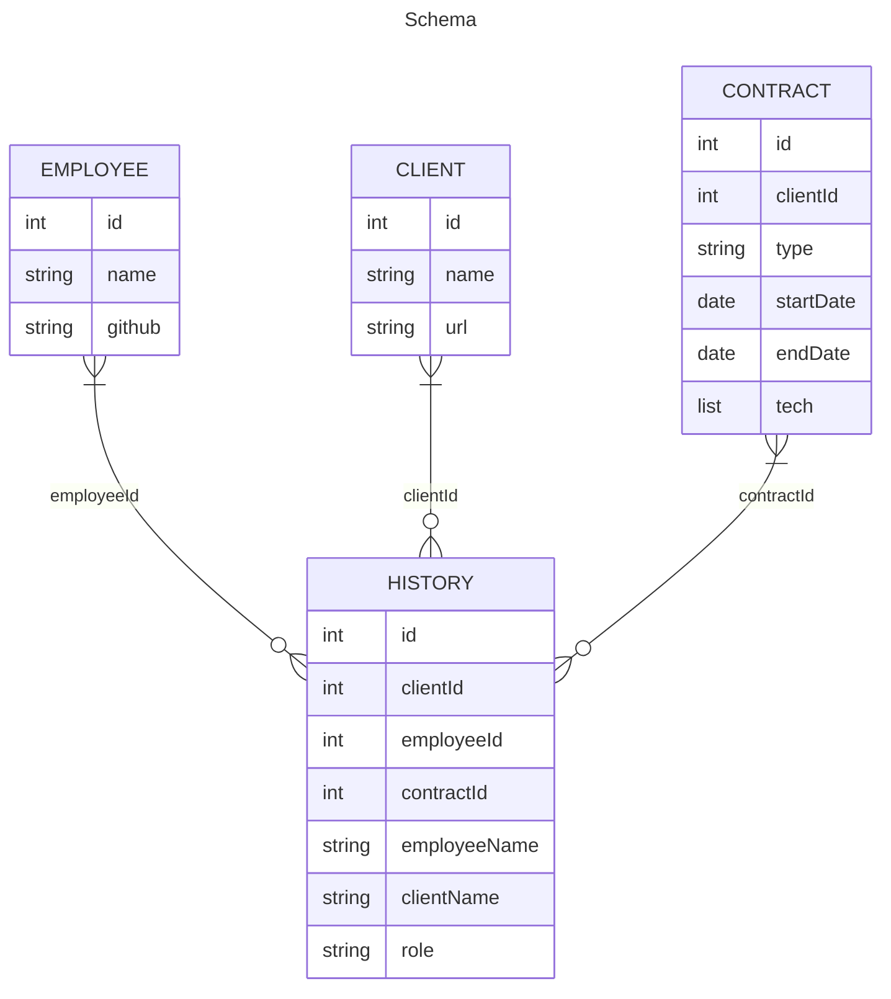

# Simple Tracker Python API

This leverages the [FastAPI framework](https://fastapi.tiangolo.com/) with [Pydantic](https://docs.pydantic.dev/)

# Production setup

`pip install requirements.txt`
`uvicorn app.main:app --host 0.0.0.0 --port 8081`

# Documentation
http://127.0.0.1/docs

### Todo

- [ ] Connect to Azure SQL DB

### In Progress

- [ ] Update/rewrite history routes
- [ ] Fix Dockerfile deployment

### Done ✓

- [x] Restructure files and structure 
- [x] Update/rewite employee routes
- [x] Update/rewrite client routes 
- [x] Update/rewrite contract routes 

